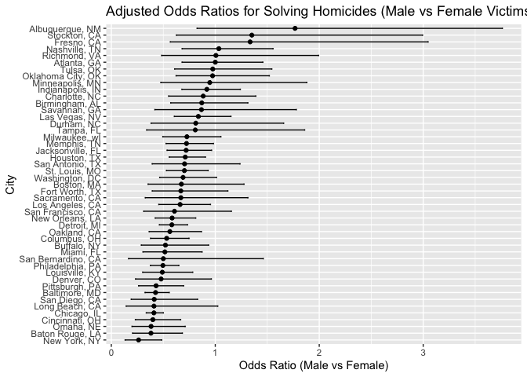
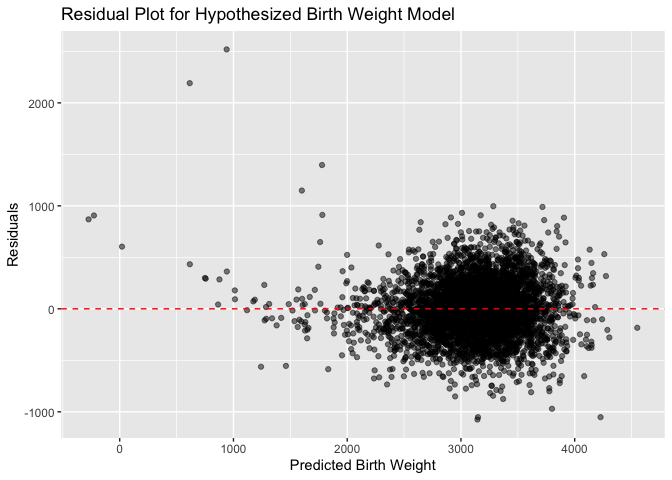

p8105_hw6_sl5685
================
Shumei Liu
2024-12-02

``` r
library(tidyverse)
```

    ## ── Attaching core tidyverse packages ──────────────────────── tidyverse 2.0.0 ──
    ## ✔ dplyr     1.1.4     ✔ readr     2.1.5
    ## ✔ forcats   1.0.0     ✔ stringr   1.5.1
    ## ✔ ggplot2   3.5.1     ✔ tibble    3.2.1
    ## ✔ lubridate 1.9.3     ✔ tidyr     1.3.1
    ## ✔ purrr     1.0.2     
    ## ── Conflicts ────────────────────────────────────────── tidyverse_conflicts() ──
    ## ✖ dplyr::filter() masks stats::filter()
    ## ✖ dplyr::lag()    masks stats::lag()
    ## ℹ Use the conflicted package (<http://conflicted.r-lib.org/>) to force all conflicts to become errors

``` r
library(modelr)
library(broom)
```

    ## 
    ## Attaching package: 'broom'
    ## 
    ## The following object is masked from 'package:modelr':
    ## 
    ##     bootstrap

``` r
library(rnoaa)
```

    ## The rnoaa package will soon be retired and archived because the underlying APIs have changed dramatically. The package currently works but does not pull the most recent data in all cases. A noaaWeather package is planned as a replacement but the functions will not be interchangeable.

``` r
library(purrr)
```

## Problem 1

``` r
weather_df = 
  rnoaa::meteo_pull_monitors(
    c("USW00094728"),
    var = c("PRCP", "TMIN", "TMAX"), 
    date_min = "2017-01-01",
    date_max = "2017-12-31") %>%
  mutate(
    name = recode(id, USW00094728 = "CentralPark_NY"),
    tmin = tmin / 10,
    tmax = tmax / 10) %>%
  select(name, id, everything())
```

    ## using cached file: /Users/shumei/Library/Caches/org.R-project.R/R/rnoaa/noaa_ghcnd/USW00094728.dly

    ## date created (size, mb): 2024-11-15 17:45:21.739631 (8.667)

    ## file min/max dates: 1869-01-01 / 2024-11-30

``` r
head(weather_df)
```

    ## # A tibble: 6 × 6
    ##   name           id          date        prcp  tmax  tmin
    ##   <chr>          <chr>       <date>     <dbl> <dbl> <dbl>
    ## 1 CentralPark_NY USW00094728 2017-01-01     0   8.9   4.4
    ## 2 CentralPark_NY USW00094728 2017-01-02    53   5     2.8
    ## 3 CentralPark_NY USW00094728 2017-01-03   147   6.1   3.9
    ## 4 CentralPark_NY USW00094728 2017-01-04     0  11.1   1.1
    ## 5 CentralPark_NY USW00094728 2017-01-05     0   1.1  -2.7
    ## 6 CentralPark_NY USW00094728 2017-01-06    13   0.6  -3.8

``` r
# Fit linear regression model
lm_model = lm(tmax ~ tmin, data = weather_df)

summary(lm_model)
```

    ## 
    ## Call:
    ## lm(formula = tmax ~ tmin, data = weather_df)
    ## 
    ## Residuals:
    ##     Min      1Q  Median      3Q     Max 
    ## -6.0304 -2.1245  0.0264  1.7264  9.4915 
    ## 
    ## Coefficients:
    ##             Estimate Std. Error t value Pr(>|t|)    
    ## (Intercept)  7.20850    0.22635   31.85   <2e-16 ***
    ## tmin         1.03924    0.01699   61.16   <2e-16 ***
    ## ---
    ## Signif. codes:  0 '***' 0.001 '**' 0.01 '*' 0.05 '.' 0.1 ' ' 1
    ## 
    ## Residual standard error: 2.938 on 363 degrees of freedom
    ## Multiple R-squared:  0.9115, Adjusted R-squared:  0.9113 
    ## F-statistic:  3741 on 1 and 363 DF,  p-value: < 2.2e-16

``` r
n_boot = 5000
set.seed(123)
```

``` r
# Run Bootstrap Procedure
bootstrap_results = replicate(n_boot, {
  boot_sample = weather_df %>% sample_frac(replace = TRUE)
  fit = lm(tmax ~ tmin, data = boot_sample)
  r_squared = glance(fit)$r.squared
  coefs = tidy(fit)$estimate
  log_beta0_beta1 = log(coefs[1] * coefs[2])
  c(r_squared, log_beta0_beta1)
})

bootstrap_df = as.data.frame(t(bootstrap_results))
colnames(bootstrap_df) = c("r_squared", "log_beta0_beta1")
```

``` r
# Calculate the 95% confidence interval for R-squared
ci_r_squared = quantile(bootstrap_df$r_squared, probs = c(0.025, 0.975))

ci_r_squared
```

    ##      2.5%     97.5% 
    ## 0.8945701 0.9271042

``` r
# Calculate the 95% confidence interval for log(beta0 * beta1)
ci_log_beta0_beta1 = quantile(bootstrap_df$log_beta0_beta1, probs = c(0.025, 0.975))

ci_log_beta0_beta1
```

    ##     2.5%    97.5% 
    ## 1.964166 2.058364

## Problem 2

``` r
# Import data
homicide_data = read_csv("./data/homicide-data.csv")
```

    ## Rows: 52179 Columns: 12
    ## ── Column specification ────────────────────────────────────────────────────────
    ## Delimiter: ","
    ## chr (9): uid, victim_last, victim_first, victim_race, victim_age, victim_sex...
    ## dbl (3): reported_date, lat, lon
    ## 
    ## ℹ Use `spec()` to retrieve the full column specification for this data.
    ## ℹ Specify the column types or set `show_col_types = FALSE` to quiet this message.

``` r
# Create city_state variable and filter the dataset
homicide_data = homicide_data |>
  mutate(city_state = paste(city, state, sep = ", ")) |>
  filter(!city_state %in% c("Dallas, TX", "Phoenix, AZ", "Kansas City, MO", "Tulsa, AL")) |>
  filter(victim_race %in% c("White", "Black")) |>
  mutate(victim_age = as.numeric(victim_age)) |>
  filter(!is.na(victim_age))
```

    ## Warning: There was 1 warning in `mutate()`.
    ## ℹ In argument: `victim_age = as.numeric(victim_age)`.
    ## Caused by warning:
    ## ! NAs introduced by coercion

``` r
# Filter data for Baltimore, MD
baltimore_data = homicide_data |>
  filter(city_state == "Baltimore, MD")

# Fit logistic regression model for Baltimore, MD
model_baltimore = glm(disposition == "Closed by arrest" ~ victim_age + victim_sex + victim_race, 
                       data = baltimore_data, family = "binomial")

# Tidy the model output and extract odds ratio for male victims
tidy_baltimore = tidy(model_baltimore, exponentiate = TRUE, conf.int = TRUE)

# Extract odds ratio for male vs female victims
odds_ratio_sex = tidy_baltimore |>
  filter(term == "victim_sexMale")
odds_ratio_sex
```

    ## # A tibble: 1 × 7
    ##   term           estimate std.error statistic  p.value conf.low conf.high
    ##   <chr>             <dbl>     <dbl>     <dbl>    <dbl>    <dbl>     <dbl>
    ## 1 victim_sexMale    0.426     0.138     -6.18 6.26e-10    0.324     0.558

``` r
# Fit logistic regression model for each city in the dataset and extract adjusted odds ratios
city_models = homicide_data |>
  group_by(city_state) |>
  nest() |>
  mutate(model = 
           map(data, ~ glm(disposition == "Closed by arrest" ~ 
                             victim_age + victim_sex + victim_race, 
                           data = ., family = "binomial")),
         tidy_model = map(model, tidy, exponentiate = TRUE, conf.int = TRUE)) |>
  unnest(tidy_model) |>
  filter(term == "victim_sexMale") |>
  select(city_state, estimate, conf.low, conf.high)
```

    ## Warning: There were 45 warnings in `mutate()`.
    ## The first warning was:
    ## ℹ In argument: `tidy_model = map(model, tidy, exponentiate = TRUE, conf.int =
    ##   TRUE)`.
    ## ℹ In group 1: `city_state = "Albuquerque, NM"`.
    ## Caused by warning:
    ## ! glm.fit: fitted probabilities numerically 0 or 1 occurred
    ## ℹ Run `dplyr::last_dplyr_warnings()` to see the 44 remaining warnings.

``` r
# Plot odds ratios and confidence intervals
ggplot(city_models, aes(x = reorder(city_state, estimate), y = estimate)) +
  geom_point() +
  geom_errorbar(aes(ymin = conf.low, ymax = conf.high), width = 0.2) +
  coord_flip() +
  labs(title = "Adjusted Odds Ratios for Solving Homicides (Male vs Female Victims)",
       x = "City", y = "Odds Ratio (Male vs Female)")
```

<!-- -->

The plot organizes cities by the estimated odds ratio (OR) of solving
homicides for male versus female victims. Some cities, like Albuquerque,
NM, and Stockton, CA, exhibit higher ORs (greater than 1), suggesting
that homicides involving male victims are more likely to be solved
compared to female victims. Conversely, cities such as New York, NY, and
Baton Rouge, LA, have ORs close to 1, indicating little to no difference
in the likelihood of solving homicides between male and female victims.
Additionally, there are cities where OR values are less than 1,
indicating that homicides involving female victims are more likely to be
solved compared to male victims. Wide confidence intervals in some
cities suggest high variability or limited sample sizes, making it
difficult to draw definitive conclusions about gender differences in
these locations.

## Problem 3

``` r
# Import data
birthweight = read_csv("./data/birthweight.csv")
```

    ## Rows: 4342 Columns: 20
    ## ── Column specification ────────────────────────────────────────────────────────
    ## Delimiter: ","
    ## dbl (20): babysex, bhead, blength, bwt, delwt, fincome, frace, gaweeks, malf...
    ## 
    ## ℹ Use `spec()` to retrieve the full column specification for this data.
    ## ℹ Specify the column types or set `show_col_types = FALSE` to quiet this message.

``` r
# clean the dataset
birthweight = birthweight |>
  mutate(
    babysex = factor(babysex, labels = c("Male", "Female")),
    frace = factor(frace),
    malform = factor(malform, labels = c("Absent", "Present")),
    mrace = factor(mrace)
  )

# Check for missing data
missing_data = colSums(is.na(birthweight))
missing_data
```

    ##  babysex    bhead  blength      bwt    delwt  fincome    frace  gaweeks 
    ##        0        0        0        0        0        0        0        0 
    ##  malform menarche  mheight   momage    mrace   parity  pnumlbw  pnumsga 
    ##        0        0        0        0        0        0        0        0 
    ##    ppbmi     ppwt   smoken   wtgain 
    ##        0        0        0        0

``` r
# Remove rows with missing data
birthweight = birthweight |> drop_na()
```

``` r
# Hypothesized Model for Birthweight
model = lm(bwt ~ bhead + blength + gaweeks + momage + ppwt + wtgain, data = birthweight)
summary(model)
```

    ## 
    ## Call:
    ## lm(formula = bwt ~ bhead + blength + gaweeks + momage + ppwt + 
    ##     wtgain, data = birthweight)
    ## 
    ## Residuals:
    ##      Min       1Q   Median       3Q      Max 
    ## -1074.77  -187.11    -6.83   175.74  2518.97 
    ## 
    ## Coefficients:
    ##               Estimate Std. Error t value Pr(>|t|)    
    ## (Intercept) -6221.8486    96.3741 -64.559  < 2e-16 ***
    ## bhead         134.0675     3.4886  38.430  < 2e-16 ***
    ## blength        78.6660     2.0630  38.131  < 2e-16 ***
    ## gaweeks        12.9680     1.4913   8.696  < 2e-16 ***
    ## momage          6.2508     1.1241   5.561 2.85e-08 ***
    ## ppwt            1.4885     0.2168   6.865 7.59e-12 ***
    ## wtgain          4.0353     0.4043   9.982  < 2e-16 ***
    ## ---
    ## Signif. codes:  0 '***' 0.001 '**' 0.01 '*' 0.05 '.' 0.1 ' ' 1
    ## 
    ## Residual standard error: 281 on 4335 degrees of freedom
    ## Multiple R-squared:  0.6993, Adjusted R-squared:  0.6989 
    ## F-statistic:  1680 on 6 and 4335 DF,  p-value: < 2.2e-16

``` r
# Cross-Validation
set.seed(123)
cv_data = crossv_mc(birthweight, 100)

# Apply Model to Cross-Validation Data
cv_data = cv_data |>
  mutate(
    model = map(train, ~ lm(bwt ~ bhead + blength + gaweeks + momage + ppwt + wtgain, data = .x)),
    rmse = map2_dbl(model, test, ~ rmse(.x, .y))
  )

mean_rmse = mean(cv_data$rmse)

# Residual Plot
model_predictions = add_predictions(birthweight, model)
model_residuals = add_residuals(model_predictions, model)

ggplot(model_residuals, aes(x = pred, y = resid)) +
  geom_point(alpha = 0.5) +
  geom_hline(yintercept = 0, linetype = "dashed", color = "red") +
  labs(
    x = "Predicted Birth Weight",
    y = "Residuals",
    title = "Residual Plot for Hypothesized Birth Weight Model"
  )
```

<!-- -->

``` r
# Monte Carlo Cross-Validation for Model Comparison
set.seed(123)
monte_carlo_splits = crossv_mc(birthweight, n = 10)
```

``` r
# Fit models to Monte Carlo splits and compute prediction errors
monte_carlo_results = monte_carlo_splits |>
  mutate(
    baseline_model = map(train, ~ lm(bwt ~ babysex + bhead + blength + delwt + gaweeks + ppbmi + smoken, data = as.data.frame(.))),
    simplified_model = map(train, ~ lm(bwt ~ blength + gaweeks, data = as.data.frame(.))),
    interaction_model = map(train, ~ lm(bwt ~ bhead * blength * babysex, data = as.data.frame(.))),
    
    error_baseline = map2_dbl(baseline_model, test, ~ mean((predict(.x, newdata = as.data.frame(.y)) - as.data.frame(.y)$bwt)^2, na.rm = TRUE)),
    error_simplified = map2_dbl(simplified_model, test, ~ mean((predict(.x, newdata = as.data.frame(.y)) - as.data.frame(.y)$bwt)^2, na.rm = TRUE)),
    error_interaction = map2_dbl(interaction_model, test, ~ mean((predict(.x, newdata = as.data.frame(.y)) - as.data.frame(.y)$bwt)^2, na.rm = TRUE))
  )
```

``` r
# Summarize prediction errors
monte_carlo_errors = monte_carlo_results |>
  summarize(
    hypothesis_mse = mean(error_baseline, na.rm = TRUE),
    length_ga_mse = mean(error_simplified, na.rm = TRUE),
    interaction_mse = mean(error_interaction, na.rm = TRUE)
  )

monte_carlo_errors
```

    ## # A tibble: 1 × 3
    ##   hypothesis_mse length_ga_mse interaction_mse
    ##            <dbl>         <dbl>           <dbl>
    ## 1         79299.       112076.          83574.

The Monte Carlo cross-validation results show that the hypothesis model
(which includes head circumference, birth length, maternal weight gain,
etc.) has a mean squared error (MSE) of 79299, indicating the best
predictive performance among the three models. The length_ga model
(which uses only birth length and gestational age) has the highest MSE
at 112076, suggesting it does not capture enough features to make
accurate predictions. The interaction model (which incorporates head
circumference, birth length, and sex with interaction terms) has an MSE
of 83574, which is higher than the hypothesis model but lower than the
length_ga model. This implies that the interaction terms improve
prediction accuracy compared to a simpler model but still do not
outperform the more comprehensive hypothesis model.
